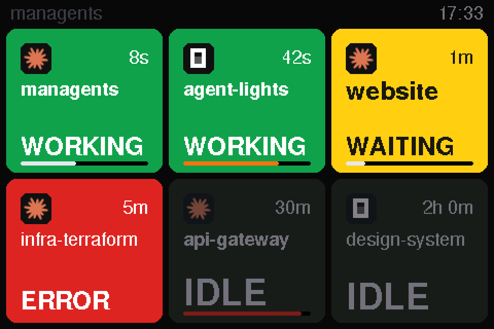
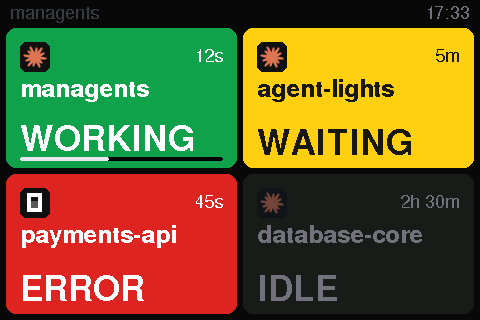
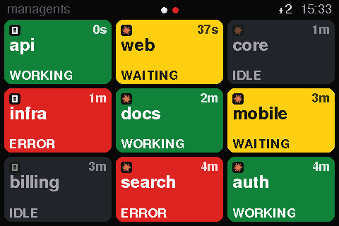
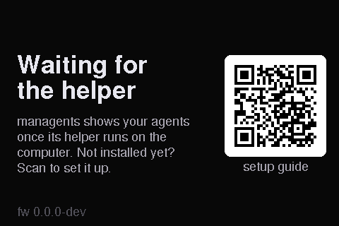
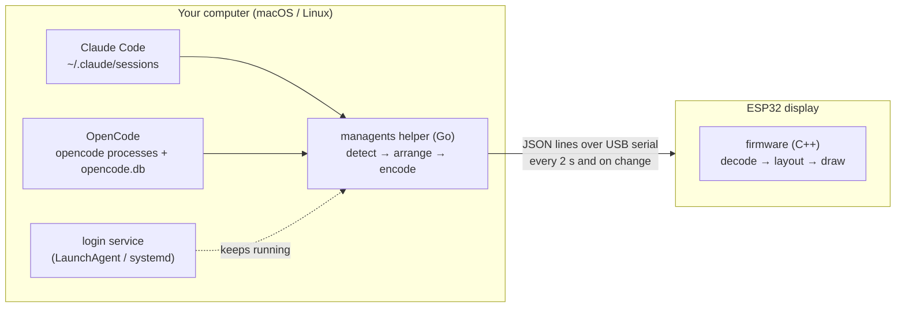

<h1 align="center">managents</h1>

<p align="center">
  
</p>

<p align="center">
  <b>A USB desk display that shows, at a glance, what your AI coding agents are doing.</b>
</p>

<p align="center">
  <a href="https://github.com/tonylook/managents/actions/workflows/ci.yml"></a>
  <a href="https://github.com/tonylook/managents/releases/latest"></a>
  <a href="LICENSE"></a>
</p>

One card per open [Claude Code](https://claude.com/claude-code) or [OpenCode](https://opencode.ai) session: green
while it works, yellow when it waits for you, red when it failed, dimmed when it has been idle for hours. Install the
helper once, plug the display in, and stop alt-tabbing to check whether an agent needs you.

<p align="center">
  
  
  
</p>
<p align="center"><sub>Rendered from the firmware's own drawing code (<code>make screens</code>), not mocked up.</sub></p>

## Get started

**1. Install the helper (once).** On macOS and Linux:

```sh
curl -fsSL https://github.com/tonylook/managents/releases/latest/download/install.sh | sh
```

It downloads the helper for your computer, checks its SHA-256, puts it in `~/.local/bin/managents` and runs
`managents service install`, so it starts at login and restarts if it stops. Nothing needs `sudo`. If
`~/.local/bin` is not on your `PATH`, the installer says how to add it. On Windows, take
`managents_windows_amd64.zip` from the [latest release](https://github.com/tonylook/managents/releases/latest): the
binary only, untested, with no service.

**2. Plug in the display** with a USB-C **data** cable. Within a couple of seconds every open Claude Code and
OpenCode session appears as a card. Unplug and replug whenever you like; the helper finds the display again.

**3. New board? Run `managents flash`.** A board straight from the shop has no managents firmware, so the helper does
not recognise it (its log says "new board? run: managents flash"). With the board plugged in:

```sh
managents flash
```

The firmware is built into the helper, so there is nothing else to install: it takes about 13 seconds, is verified
against the chip's own checksum, and stops and restarts the service around the transfer.

**Upgrade** by running the one-liner again; if the log or `managents devices` says the display's firmware is out of
date, run `managents flash`. **Uninstall:** `managents service uninstall`, then delete `~/.local/bin/managents`. That
removes everything the helper put on your computer.

Something not working? See [Troubleshooting](docs/troubleshooting.md).

## What the display shows

| Card | Meaning | RGB LED |
|---|---|---|
| **WORKING** (green) | the agent is running a turn | green |
| **WAITING** (yellow) | it needs you: a permission prompt, a question, or a finished turn | orange |
| **ERROR** (red) | the last turn ended in an API or model error; blinks for the first minute | red, blinking the first minute |
| **IDLE** (dark) | open but untouched for more than 2 hours | off |

Each card has the agent's logo, the folder name, how long it has been in that state and, along its bottom edge, a bar
for how full the context window is. The agents you work with come first: working sessions, then the most recent
changes. Nine cards fit on a page; **tap anywhere** to turn the page (it returns to the first after 30 seconds). The
dots in the header are coloured by what the other pages need: red when one holds an error, yellow when one has a
waiting agent. A `+N` badge counts sessions that do not fit. When every agent has been idle (or there are none) for
five minutes, the backlight dims; a tap wakes it.

Three screens say what is going on with the computer: **Connecting** right after power-up, **Setup needed** (with a QR
code to the steps above) when the helper has not been heard from for 15 seconds, and **Reconnecting** when it stopped
talking, which usually means the computer went to sleep.

> **About the LED.** The RGB LED sits on the **back** of the board, behind the screen, so you do not see it from the
> front. It glows through the back grille onto the wall behind the display, or perhaps through a white or
> translucent case (untested); do not count on it as an indicator. The screen is the display.

## How it works



- **The display is dumb on purpose.** It draws what it receives and nothing else: no Wi-Fi, no Bluetooth, no
  settings. Detection lives on the computer, so a change in how an agent stores its state needs a helper update, never
  a reflash.
- **One USB cable** carries power and data.
- **Nothing to configure.** The helper finds the display by asking each USB serial port "are you managents?".

More in [docs/architecture.md](docs/architecture.md) and the [serial protocol](docs/protocol.md).

## Privacy

The helper reads Claude Code's session files (`~/.claude/sessions`), the **end** of each open session's transcript,
OpenCode's database (read-only) and the list of running processes. From the transcripts it decodes only status
fields, timestamps and token counts; conversation text is never decoded, stored, logged or sent. The only thing that
leaves the computer is what goes down the USB cable: each session's folder name, status, age and context-window
usage. There is no network access and no telemetry, and the display has no radio. Tests enforce the text part. See
[SECURITY.md](SECURITY.md).

## Hardware

| Part | Notes |
|---|---|
| [LCDWiki 4.0" ESP32-32E display](https://www.lcdwiki.com/4.0inch_ESP32-32E_Display), **E32R40T** | ESP32-WROOM-32E, ST7796S 320 × 480 SPI, resistive touch, CH340C USB bridge, RGB LED. Details in [docs/hardware.md](docs/hardware.md). |
| USB-C data cable | A right-angle plug keeps it flat on the desk. |
| Optional: the 3D-printed 45° enclosure | 2 parts, no supports, 4 × M3×10 screws, 4 × M3 heat-set inserts and 4 self-adhesive rubber feet Ø10 mm (required). Print and assembly: [enclosure/](enclosure/README.md). |

<p align="center">
  
</p>

On Windows the CH340 driver may be needed; macOS and Linux include one.

## Compatibility

| Component | Status | Notes |
|---|---|---|
| macOS 26, Apple silicon | tested | Supported. The helper is one universal binary. |
| macOS, Intel | built, not tested | The universal binary includes it. |
| Linux, amd64 and arm64 | best effort | Unit tests run in CI. systemd user unit. Your user needs the `dialout` (or `uucp`) group to open serial ports. |
| Windows 11 | binary only, untested | Unit tests run in CI. No service: start `managents.exe run` yourself. |
| Claude Code (terminal and desktop app) | supported | Read from its session files. |
| OpenCode | supported | Read from its process list and database. |
| E32R40T display | tested | The target board. |
| E32N40T display (no touch) | untested | Build the firmware with `-DMANAGENTS_TOUCH=0`. |

## Development

```sh
make help            # every target
make test            # helper tests (go test -race) + firmware core tests (pio test -e native)
make lint            # gofmt, go vet, staticcheck, govulncheck, shellcheck, clang-format
make build           # helper binary (bin/managents) + firmware image
make screens         # re-render docs/screens from the firmware's own UI code
make enclosure       # re-render the STLs (needs OpenSCAD); `make enclosure-check` checks they are solid
```

Everything except flashing runs without the hardware. See [CONTRIBUTING.md](CONTRIBUTING.md); AI coding agents should
read [AGENTS.md](AGENTS.md).

## Roadmap

v0.2 turned the MVP into something you install: a login service, a built-in flasher, one-line install and releases
with checksums. Next, in no fixed order: a long-press detail view, sound, more agents (Codex, Gemini CLI, Aider),
Windows support, other boards. See [docs/roadmap.md](docs/roadmap.md) and the [changelog](CHANGELOG.md).

## Credits

managents grew out of *agent-lights*, a phone-based proof of concept. Built with
[LovyanGFX](https://github.com/lovyan03/LovyanGFX), [ArduinoJson](https://arduinojson.org),
[go.bug.st/serial](https://github.com/bugst/go-serial), [gopsutil](https://github.com/shirou/gopsutil) and
[modernc.org/sqlite](https://gitlab.com/cznic/sqlite); see [THIRD_PARTY_NOTICES.md](THIRD_PARTY_NOTICES.md).

Claude and Claude Code are trademarks of Anthropic; OpenCode belongs to its authors. This project is not affiliated
with either.

## License

[MIT](LICENSE)
