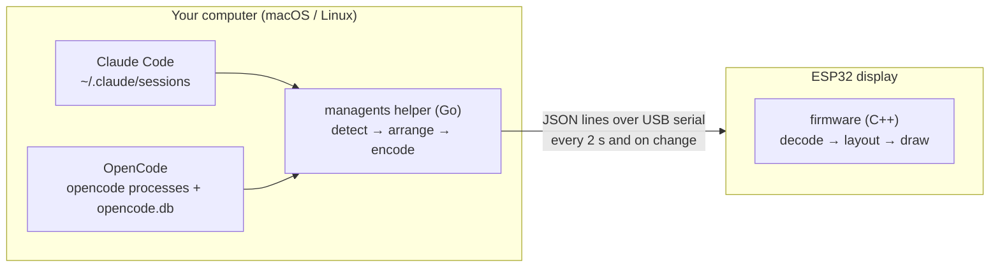

# managents

**A USB desk display that shows, at a glance, what your AI coding agents are doing.**

One card per open [Claude Code](https://claude.com/claude-code) or [OpenCode](https://opencode.ai) session:
green while it works, yellow when it waits for you, red when it failed, dimmed when it has been idle for hours.
Plug in the display, run the helper, and stop alt-tabbing to check whether an agent needs you.

<p align="center">
  
</p>

| Card | Meaning |
|---|---|
| 🟩 **WORKING** | the agent is running a turn |
| 🟨 **WAITING** | it needs you: a permission prompt, a question, or a finished turn |
| 🟥 **ERROR** (blinking) | the last turn ended in an API or model error |
| ⬛ **IDLE** | open but untouched for more than 2 hours |

Each card also shows how long the agent has been in that state and, for Claude Code, a bar with how full its context
window is. The agents you are actively working with come first: working sessions, then the most recent changes;
whatever has been idle the longest moves to the next page (nine cards per page, tap anywhere to turn it). The
board's RGB LED mirrors the most urgent state, so you notice even when you are not looking at the screen.

## How it works



- **The display is dumb on purpose.** It draws what it receives and nothing else: no Wi-Fi, no Bluetooth, no
  configuration. Detection logic lives on the computer, so a change in how an agent stores its state needs a helper
  update, never a reflash.
- **One USB cable** carries power and data.
- **Privacy:** the helper reads session *metadata* only (status, working directory, timestamps, token counts). It
  never reads, logs or transmits conversation content.

## Hardware

| Part | Notes |
|---|---|
| LCDWiki 4.0" ESP32-32E display, **E32R40T** (resistive touch) or E32N40T | ESP32-WROOM-32E, ST7796S 320×480 SPI, XPT2046, CH340C USB-serial, RGB LED. See [docs/hardware.md](docs/hardware.md). |
| USB-C data cable | |
| Optional: the 3D-printed 45° enclosure | 2 parts, no supports, 4 × M3×10 screws + 4 × M3 heat-set inserts. See [enclosure/](enclosure/README.md). |

On Windows the CH340 driver may be needed; macOS and Linux include one.

## Quick start

Prerequisites: [Go](https://go.dev/dl/) ≥ 1.26 and [PlatformIO Core](https://docs.platformio.org/en/latest/core/installation/index.html).

```bash
git clone https://github.com/tonylook/managents.git && cd managents

make flash                 # build the firmware and flash the display (PORT=/dev/cu.usbserial-10 to pick a port)
make helper                # build bin/managents
bin/managents              # stream your agents to the display (Ctrl-C to stop)
```

Other helper commands:

```text
managents status [--json]   what the helper detects right now, without a display
managents devices           which serial ports have a managents display
managents demo              cycle demo screens (all layouts and states) on the display
```

To start the helper at login, see [helper/README.md](helper/README.md#start-at-login).

## Repository layout

| Path | What |
|---|---|
| [`firmware/`](firmware/README.md) | ESP32 firmware (PlatformIO, Arduino, LovyanGFX). Hardware-independent core in `lib/core`, unit-tested on the host. |
| [`helper/`](helper/README.md) | Host helper (Go): session detection, protocol encoding, serial transport. |
| [`protocol/`](protocol/) | The contract: JSON Schemas and shared fixtures, tested by **both** sides. |
| [`enclosure/`](enclosure/README.md) | Parametric OpenSCAD enclosure, inclined 45°, with ready-to-print STLs. |
| [`docs/`](docs/) | [Architecture](docs/architecture.md), [protocol](docs/protocol.md), [hardware](docs/hardware.md), [decisions](docs/adr/), [roadmap](docs/roadmap.md). |

## Development

```bash
make test            # helper tests (go test -race) + firmware core tests (pio test -e native)
make lint            # go vet, staticcheck, gofmt, clang-format
make build           # helper binary + firmware image
make enclosure       # render the STLs (needs OpenSCAD)
```

Everything except flashing runs without the hardware. See [CONTRIBUTING.md](CONTRIBUTING.md).

## Roadmap

The MVP is a passive status display. Next: touch interaction (tap a card for details, calibration), sound on state
changes, more agents (Codex, Gemini CLI, Aider), signed releases with a web flasher, and enclosure v2. Details and
milestones in [docs/roadmap.md](docs/roadmap.md).

## Credits

managents grew out of *agent-lights*, a phone-based proof of concept. Built with
[LovyanGFX](https://github.com/lovyan03/LovyanGFX), [ArduinoJson](https://arduinojson.org),
[go.bug.st/serial](https://github.com/bugst/go-serial), [gopsutil](https://github.com/shirou/gopsutil) and
[modernc.org/sqlite](https://gitlab.com/cznic/sqlite).

Claude and Claude Code are trademarks of Anthropic; OpenCode belongs to its authors. This project is not affiliated
with either.

## License

[MIT](LICENSE)
