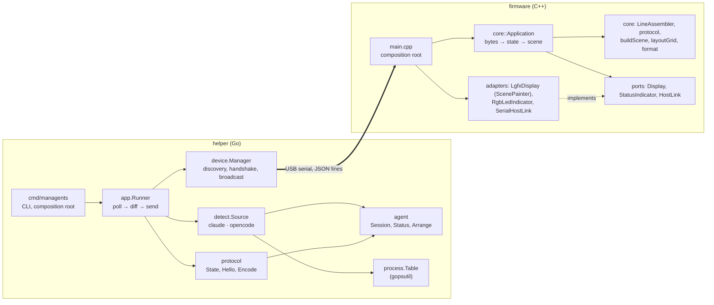
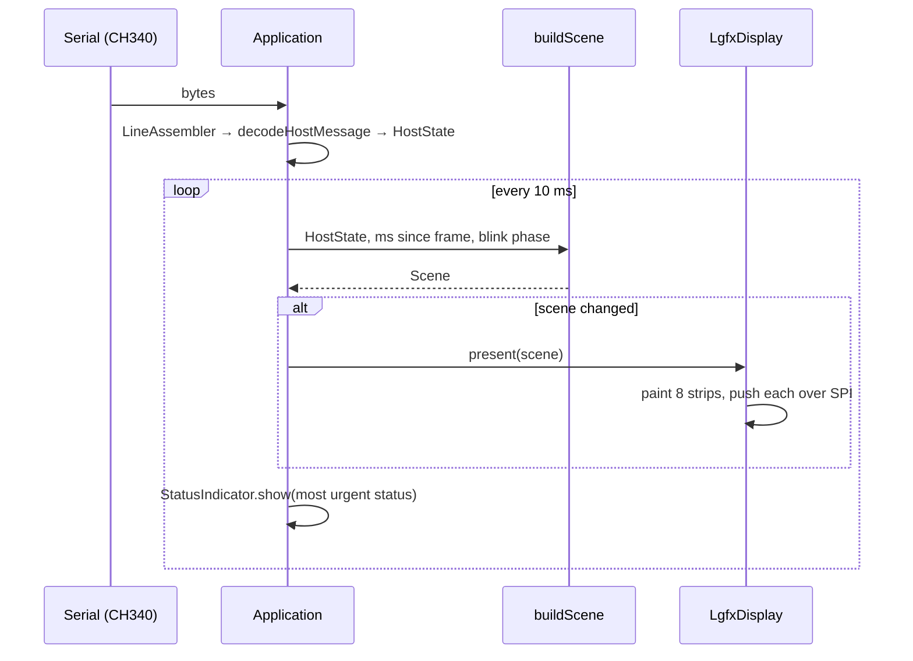

# Architecture

managents has two programs and one contract:

- the **helper** runs on the computer, finds agent sessions and streams their state;
- the **firmware** runs on the display and draws what it receives;
- the **protocol** ([protocol.md](protocol.md), [`protocol/`](../protocol)) is the only thing they share.

Both programs follow the same shape: a hardware- and OS-independent core holding the behaviour, surrounded by thin
adapters for the outside world (ports and adapters / hexagonal architecture). The core is where the tests are.

## Helper

| Package | Responsibility | Depends on |
|---|---|---|
| `internal/agent` | Domain model: `Session`, `Status`, `Kind`; `Arrange` orders sessions by activity and gives them unique short names. | nothing |
| `internal/detect` | `Source` interface and `All` (merge, tolerate a failing source). | `agent` |
| `internal/detect/claude` | Reads Claude Code's live session registry; filters stale records by pid + start time; reads the transcript tail for API errors and context size. | `agent`, `process` |
| `internal/detect/opencode` | Finds `opencode` processes; status from `opencode.db` through a `Store` interface (SQLite implementation extracts JSON fields inside SQLite). | `agent`, `process` |
| `internal/process` | `Table` interface over the OS process list (gopsutil). | — |
| `internal/protocol` | Wire types, `NewState` (cap, truncate, fit in a line), `Encode`, `ParseDeviceHello`. | `agent` |
| `internal/device` | Serial port enumeration, `hello` handshake, `Manager` (hot-plug, multi-display broadcast). | `protocol` |
| `internal/app` | `Runner`: poll every second, send on change or every 2 s, discover displays every 2 s. | interfaces only |
| `internal/demo` | Canned scenes for `managents demo`. | `agent` |
| `cmd/managents` | CLI and wiring. The only place that knows the concrete types. | everything |

Rules that keep it clean:

- Dependencies point inward: `agent` imports nothing; detectors never import `protocol` or `device`.
- Every external system sits behind a small interface (`process.Table`, `opencode.Store`, `device.Opener`,
  `device.Enumerator`, `app.Displays`), so tests use fakes and no test needs a real agent, port or database server.
- Sessions are read-only metadata. Message content never leaves the reader: the Claude transcript decoder declares
  only metadata fields and SQLite extracts OpenCode's JSON fields itself.

## Firmware

| Unit | Responsibility |
|---|---|
| `lib/core` | Everything testable: `LineAssembler` (framing, oversize lines), `decodeHostMessage` (validation; a frame applies entirely or not at all), `buildScene` (pure: state + time + page → what to show), `layoutGrid` (card grid for any screen and orientation), `Pager` and `TapDetector` (nine cards per page, a tap anywhere turns it), `format*`, `Application` (link timeout, blink, redraw only on change), ports. No Arduino, no dynamic allocation in the model (`FixedString`, fixed arrays). |
| `src/board` | Board support: pin map and the LovyanGFX device for the E32R40T. |
| `src/ui` | `ScenePainter` draws a `Scene` on any LovyanGFX canvas; theme, fonts, vector logos. |
| `src/adapters` | `LgfxDisplay` (renders the scene in 40-px strips through a 38 KB sprite: flicker-free without a 300 KB frame buffer, which the PSRAM-less ESP32 does not have), `RgbLedIndicator`, `SerialHostLink`, `TouchSensor` (pressed or not; no calibration needed to turn pages). |
| `src/main.cpp` | Composition root and the loop: pump serial bytes and touch state into the application, tick it. |

### Data flow on the display

The scene changes when data changes, when an age or the clock ticks over (at most once per second), and every half
second for blinking error cards. A full redraw is about 90 ms of SPI transfer (480 × 320 × 16 bit at 27 MHz).

## Why this split

The display is deliberately passive (see [ADR-0002](adr/0002-dumb-display-smart-helper.md)): agent tools change how
they store state far more often than anyone wants to reflash a device. Keeping layout on the device, however, lets
each display adapt to its own screen size and orientation without the helper knowing about it.
