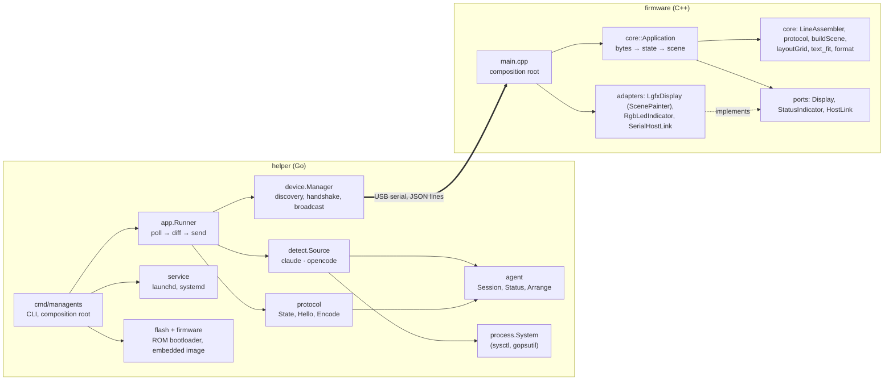
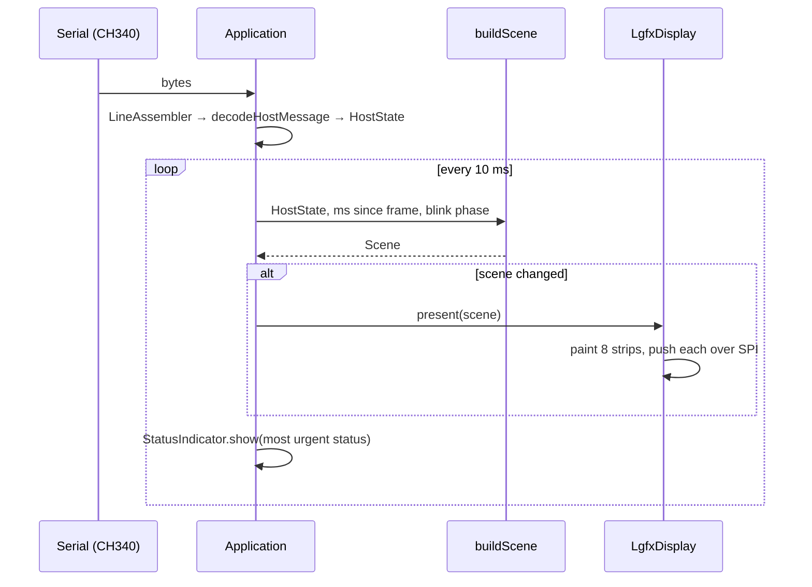

# Architecture

managents has two programs and one contract:

- the **helper** runs on the computer, finds agent sessions and streams their state;
- the **firmware** runs on the display and draws what it receives;
- the **protocol** ([protocol.md](protocol.md), [`protocol/`](../protocol)) is the only thing they share.

Both programs follow the same shape: a hardware- and OS-independent core holding the behaviour, surrounded by thin
adapters for the outside world (ports and adapters / hexagonal architecture). The core is where the tests are.

## Helper

| Package | Responsibility | Depends on |
|---|---|---|
| `internal/agent` | Domain model: `Session`, `Status`, `Kind`; `Arrange` orders sessions by activity and gives them unique short names. | nothing |
| `internal/detect` | `Source` interface and `All` (merge, tolerate a failing source). | `agent` |
| `internal/detect/claude` | Reads Claude Code's live session registry; filters stale records by pid + start time; reads the transcript tail for API errors and context size. | `agent` (asks for process start times through a one-method interface of its own) |
| `internal/detect/opencode` | Finds `opencode` processes; status from `opencode.db` through a `Store` interface (the SQLite implementation extracts JSON fields inside SQLite). | `agent`, `process` (for the process type, behind an interface of its own) |
| `internal/process` | `System`: the OS process list. On macOS one `kern.proc.all` sysctl, elsewhere gopsutil. Each detector declares the one interface it needs from it. | nothing |
| `internal/protocol` | Wire types, `NewState` (cap, truncate, fit in a line), `Encode`, `ParseDeviceHello`; the version helpers and `MinFirmware`. | `agent` |
| `internal/device` | Serial port enumeration, `hello` handshake, `Manager` (hot-plug, retry schedule, multi-display broadcast). | `protocol` |
| `internal/app` | `Runner`: poll every second, send on change or every 2 s, discover displays every 2 s without delaying frames. | `agent`, `detect`, `protocol` |
| `internal/service` | `Manager`: install, uninstall, start, stop and report the per-user background service (LaunchAgent, systemd user unit) through a `Commander` port. | nothing |
| `internal/flash` | The ESP32 ROM bootloader protocol: SLIP framing, sync, SPI attach, compressed write, MD5 check, reset. Behind a small serial port interface, tested against a fake ROM. | `device` |
| `internal/firmware` | The display firmware image and its version, embedded in the binary (`go:embed`). | nothing |
| `internal/demo` | Canned scenes, with made-up names, for `managents demo`. | `agent` |
| `cmd/managents` | CLI (commands, flags, exit codes, log setup) and wiring. The only place that knows the concrete types. | everything |

Rules that keep it clean:

- Dependencies point inward: `agent` imports nothing; detectors never import `protocol` or `device`.
- Every external system sits behind a small interface (the detectors' process and store interfaces, `device.Opener`,
  `device.Enumerator`, `app.Displays`, `service.Commander`, the flasher's serial port), so tests use fakes and no
  test needs a real agent, port, database server or service manager.
- Sessions are read-only metadata. Message content never leaves the reader: the Claude transcript decoder declares
  only metadata fields and SQLite extracts OpenCode's JSON fields itself.
- The helper makes no network connections. It runs as the user, as a service that is always on
  ([ADR-0010](adr/0010-always-on-user-service.md)).

## Firmware

| Unit | Responsibility |
|---|---|
| `lib/core` | Everything testable: `LineAssembler` (framing, oversize lines), `decodeHostMessage` (validation; a frame applies entirely or not at all), `buildScene` (pure: state + time + page + link state → what to show), `layoutGrid` (card grid for any screen and orientation), `fitName`/`TextMeasure` (`text_fit`: names fitted into a box, behind a text-measuring port), `Pager` and `TapDetector` (nine cards per page, a tap anywhere turns it), `format*` (ages, clock, folding names to ASCII), `Application` (link timeouts and the Connecting, Setup needed and Reconnecting screens, blink window, backlight dimming, redraw only on change), ports. No Arduino, no dynamic allocation in the model (`FixedString`, fixed arrays). |
| `src/board` | Board support: pin map and the LovyanGFX device for the E32R40T. |
| `src/ui` | `ScenePainter` draws a `Scene` on any LovyanGFX canvas; theme, fonts, vector logos, text measuring. |
| `src/adapters` | `LgfxDisplay` (renders the scene in 40-px strips through a 38 KB sprite: flicker-free without a 300 KB frame buffer, which the PSRAM-less ESP32 does not have), `RgbLedIndicator`, `SerialHostLink`, `TouchSensor` (pressed or not; no calibration needed to turn pages). |
| `src/main.cpp` | Composition root and the loop: pump serial bytes and touch state into the application, tick it. The loop runs under the 5 s task watchdog: a hang reboots the board, which says hello again. |
| `sim/` | The host renderer: the real `ui/` and `LgfxDisplay` on a headless LovyanGFX, protocol fixtures in, PNGs out (`make screens`, [ADR-0011](adr/0011-host-renderer.md)). Not part of the board build. |

### Data flow on the display

The scene changes when data changes, when an age or the clock ticks over (at most once per second), and every half
second for blinking error cards (only during an error's first minute). A full redraw is about 90 ms of SPI transfer (480 × 320 × 16 bit at 27 MHz).

## Distribution

The helper is the one thing a user installs: `install.sh` fetches it from a release, `managents service install` makes
it start at login, and `managents flash` writes the firmware that is embedded in it
([ADR-0012](adr/0012-built-in-flasher.md)). Release builds take their version from the git tag, for the helper and
the firmware alike; see [CONTRIBUTING.md](../CONTRIBUTING.md#releasing).

## Why this split

The display is deliberately passive (see [ADR-0002](adr/0002-dumb-display-smart-helper.md)): agent tools change how
they store state far more often than anyone wants to reflash a device. Keeping layout on the device, however, lets
each display adapt to its own screen size and orientation without the helper knowing about it.
