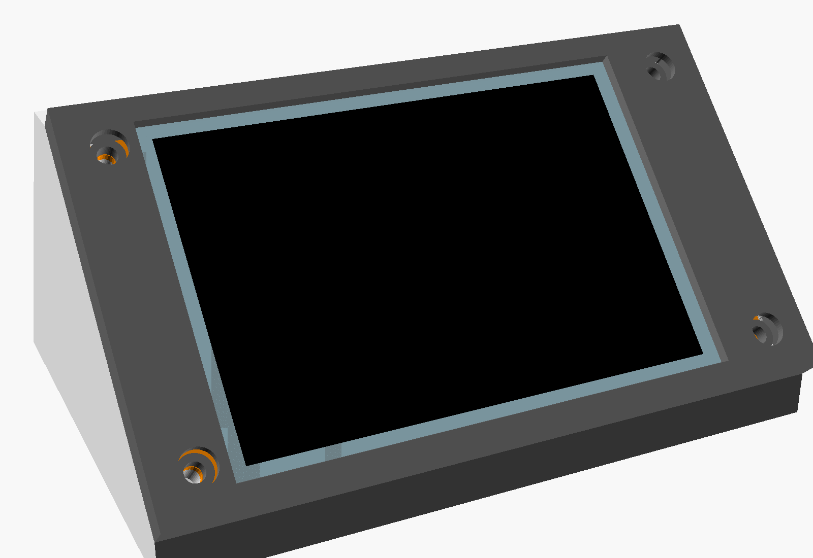
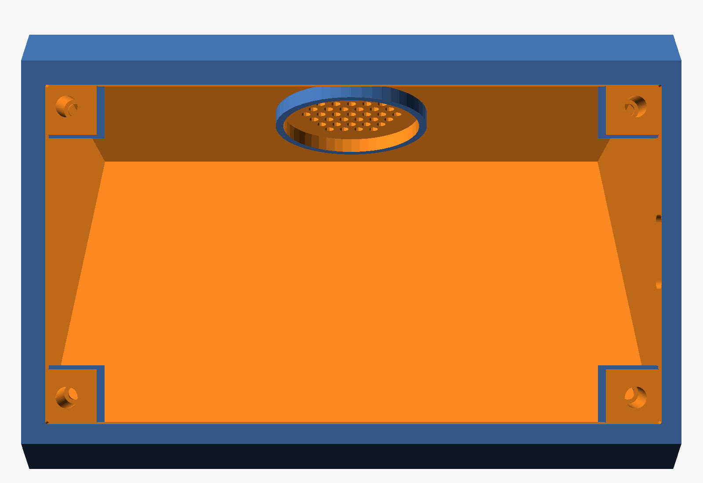
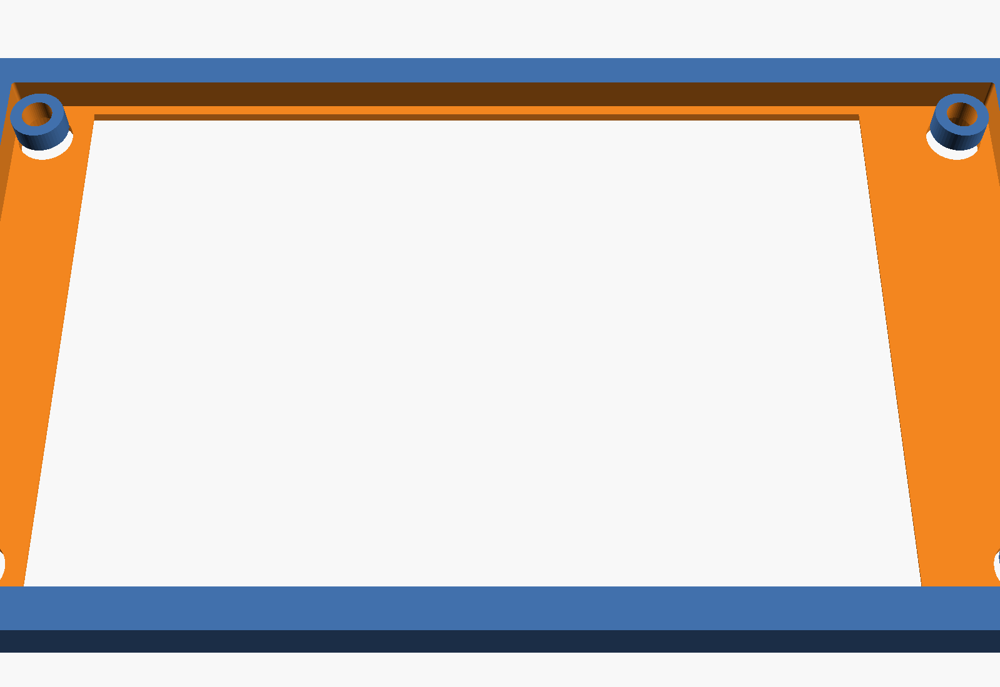
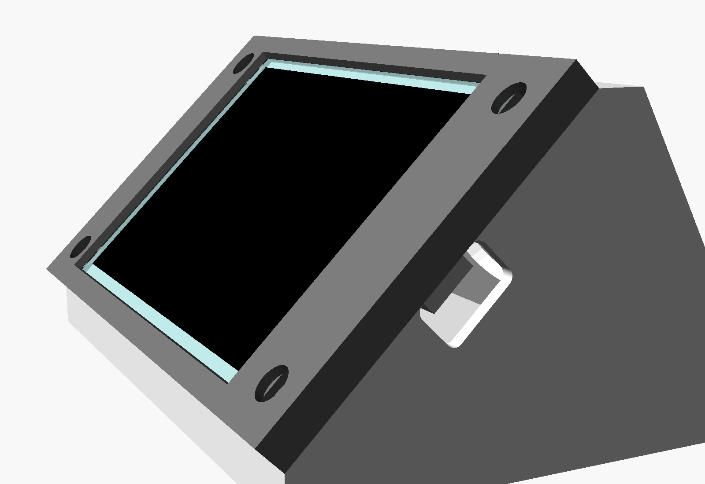

# managents enclosure

A desk wedge that holds the LCDWiki 4.0" ESP32-32E display (E32R40T) at **45°**, in landscape with the USB-C port
on the right. Two parts, no supports. Designed in OpenSCAD from the vendor's dimensioned drawing.

<p align="center">
  
</p>

| Body | Bezel (print orientation) | Side |
|---|---|---|
|  |  |  |

Overall size: **120 × 88 × 57 mm** (w × d × h) plus the 6 mm bezel.

## Print

| Part | File | Orientation | Notes |
|---|---|---|---|
| Fit test | [`stl/managents-fit_test.stl`](stl/managents-fit_test.stl) | flat | **Print this first** (≈10 min). Lay the board on it: the four pins must enter the holes and the window must frame the image. |
| Body | [`stl/managents-body.stl`](stl/managents-body.stl) | standing on its base, as exported | All overhangs are 45° or steeper. |
| Bezel | [`stl/managents-bezel.stl`](stl/managents-bezel.stl) | face down, as exported | |

Suggested settings: PLA or PETG, 0.2 mm layers, 3 walls, 15 % infill, no supports.

## Bill of materials

| Qty | Part |
|---|---|
| 1 | LCDWiki 4.0" ESP32-32E display, E32R40T (or E32N40T) |
| 4 | M3 × 10 socket or pan head screws |
| 4 | M3 heat-set inserts, Ø4 hole × 5.7 mm (or set `insert_d = 2.8` for self-tapping screws) |
| 4 | Self-adhesive rubber feet, Ø10 mm (optional) |
| 1 | 28 mm 8 Ω speaker with a 1.25 mm JST plug (optional, for the roadmap's sound feature) |

## Assemble

1. Press the four heat-set inserts into the corner blocks of the body with a soldering iron.
2. (Optional) glue the speaker into the ring behind the back grille and plug it into the board's SPEAKER socket.
3. Drop the board into the face, screen up, USB-C towards the side opening.
4. Put the bezel on and fasten the four screws. Tighten gently: the bezel presses on the PCB's mounting pads only,
   never on the glass, so the resistive touch panel stays free.
5. Stick the rubber feet into the recesses under the base.

## Customise

Everything is a parameter at the top of [`managents_case.scad`](managents_case.scad): `face_angle`, `base_depth`,
`lip_h`, wall thickness, clearances, screw and insert sizes, speaker on/off. Board dimensions are in
[`lib/e32r40t.scad`](lib/e32r40t.scad), taken from the vendor drawing (see [docs/hardware.md](../docs/hardware.md#mechanical-data)).

```bash
openscad managents_case.scad                                   # interactive, part = "assembly"
openscad -D 'part="section"' managents_case.scad               # assembly cut in half: check clearances
make enclosure                                                 # re-render all STLs (from the repo root)
```

## Status

v1 is designed from the drawing and checked in renders, not yet printed. Measured corrections go into
`lib/e32r40t.scad`; planned improvements are in the [roadmap](../docs/roadmap.md#enclosure-v2).
